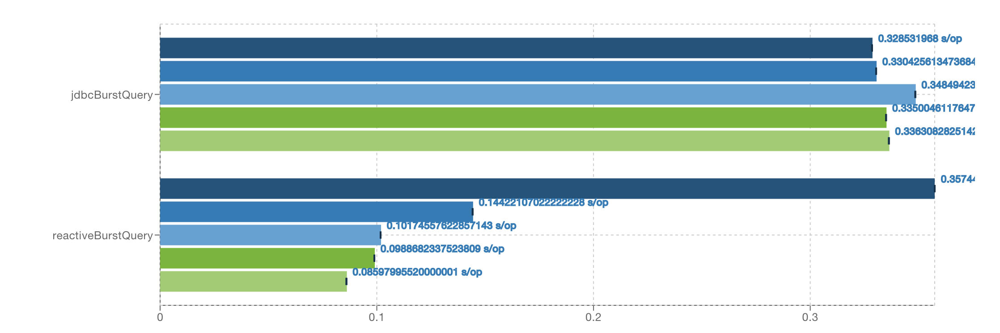
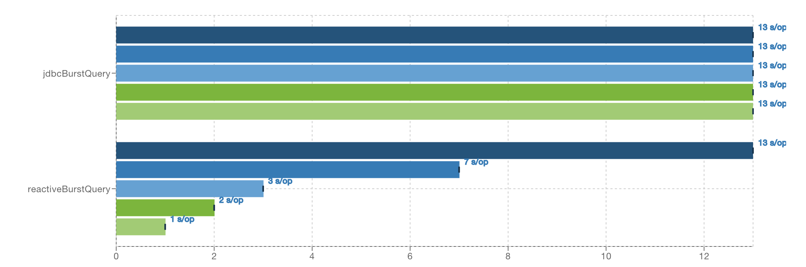

= Reactive Postgres Client


image:https://travis-ci.org/reactiverse/reactive-pg-client.svg?branch=master["Build Status",link="https://travis-ci.org/reactiverse/reactive-pg-client"]

* Simple API focusing on scalability and low overhead.
* Reactive and non blocking which able to handle many database connections with a single thread.
* Ranked *#1* in the https://www.techempower.com/benchmarks/#section=data-r15&hw=ph&test=db[TechEmpower Benchmark Round 15] _Single query_ benchmark.

== Features

- Event driven
- Lightweight
- Built-in connection pooling
- Prepared queries caching
- Publish / subscribe using Postgres `LISTEN/NOTIFY`
- Batch and cursor support
- Row streaming
- `java.util.stream.Collector` row set transformation
- Command pipeling
- RxJava 1 and RxJava 2
- Direct memory to object without unnecessary copies
- Java 8 Date and Time
- SSL/TLS
- Unix domain socket
- HTTP/1.x CONNECT, SOCKS4a or SOCKS5 proxy
- Request cancellation

== Usage

Latest release is https://github.com/reactiverse/reactive-pg-client/blob/master/RELEASES.adoc[0.11.2].

To use the client, add the following dependency to the _dependencies_ section of your build descriptor:

* Maven (in your `pom.xml`) for Vert.x 3.6.x:

[source,xml]
----
<dependency>
  <groupId>io.reactiverse</groupId>
  <artifactId>reactive-pg-client</artifactId>
  <version>0.11.2</version>
</dependency>
----

* Gradle (in your `build.gradle` file)  for Vert.x 3.6.x:

[source,groovy]
----
dependencies {
  compile 'io.reactiverse:reactive-pg-client:0.11.2'
}
----

If you are using Vertx 3.5.x you should use instead `0.10.9`

Then the code is quite straightforward:

[source,java]
----
// Pool options
PgPoolOptions options = new PgPoolOptions()
  .setPort(5432)
  .setHost("the-host")
  .setDatabase("the-db")
  .setUser("user")
  .setPassword("secret")
  .setMaxSize(5);

// Create the client pool
PgPool client = PgClient.pool(options);

// A simple query
client.query("SELECT * FROM users WHERE id='julien'", ar -> {
  if (ar.succeeded()) {
    PgResult<Row> result = ar.result();
    System.out.println("Got " + result.size() + " results ");
  } else {
    System.out.println("Failure: " + ar.cause().getMessage());
  }

  // Now close the pool
  client.close();
});
----

== Integration / Usages

* https://github.com/jklingsporn/vertx-jooq[vertx-jooq]: writing type safe queries and let them run at high speed using jOOQ, vertx and the reactive-pg-client.
* https://docs.micronaut.io/latest/guide/index.html#postgresSupport[Micronaut]: supports reactive and non-blocking client to connect to Postgres using reactive-pg-client, allowing to handle many database connections with a single thread.

== Documentations

* https://reactiverse.io/reactive-pg-client/guide/java/index.html[Java docs]
* https://reactiverse.io/reactive-pg-client/guide/kotlin/[Kotlin docs]
* https://reactiverse.io/reactive-pg-client/guide/groovy/index.html[Groovy docs]
* https://reactiverse.io/reactive-pg-client/guide/ruby/index.html[Ruby docs]
* https://reactiverse.io/reactive-pg-client/guide/js/index.html[JavaScript docs]

== Javadoc

* https://reactiverse.io/reactive-pg-client/apidocs/index.html[Javadoc]

== Pipelining

This client supports pipelining requests to the database which can give a significant performance
improvement depending on the latency to the database and the type of queries your
application is doing.

.100µs latency


.1ms latency


Such results have been produced using this https://github.com/vietj/pg-client-concurrency-benchmark[benchmark].

WARNING: The two results are not normalized, the 100µs latency executes the 5000 queries
in about 300ms, the 1ms latency executes the 5000 queries in about 13 seconds.

== Supported Data Types

The *Reactive Postgres Client* currently supports the following data types

[cols="^,^,^,^,^", options="header"]
|====
| _
2+| Value
2+| Array

| Postgres | Java | Supported | JAVA | Supported

|`BOOLEAN`
|`j.l.Boolean`
|&#10004;
|`j.l.Boolean[]`
|&#10004;

|`INT2`
|`j.l.Short`
|&#10004;
|`j.l.Short[]`
|&#10004;

|`INT4`
|`j.l.Integer`
|&#10004;
|`j.l.Integer[]`
|&#10004;

|`INT8`
|`j.l.Long`
|&#10004;
|`j.l.Long[]`
|&#10004;

|`FLOAT4`
|`j.l.Float`
|&#10004;
|`j.l.Float[]`
|&#10004;

|`FLOAT8`
|`j.l.Double`
|&#10004;
|`j.l.Double[]`
|&#10004;

|`CHAR`
|`j.l.Character`
|&#10004;
|`j.l.Character[]`
|&#10004;

|`VARCHAR`
|`j.l.String`
|&#10004;
|`j.l.String[]`
|&#10004;

|`TEXT`
|`j.l.String`
|&#10004;
|`j.l.String[]`
|&#10004;

|`ENUM`
|`j.l.String`
|&#10004;
|`j.l.String[]`
|&#10004;

|`NAME`
|`j.l.String`
|&#10004;
|`j.l.String[]`
|&#10004;

|`SERIAL2`
|`j.l.Short`
|&#10004;
|`invalid type`
|&#10005;

|`SERIAL4`
|`j.l.Integer`
|&#10004;
|`invalid type`
|&#10005;

|`SERIAL8`
|`j.l.Long`
|&#10004;
|`invalid type`
|&#10005;

|`NUMERIC`
|`i.r.p.data.Numeric`
|&#10004;
|`i.r.p.data.Numeric[]`
|&#10004;

|`UUID`
|`j.u.UUID`
|&#10004;
|`j.u.UUID[]`
|&#10004;

|`DATE`
|`j.t.LocalDate`
|&#10004;
|`j.t.LocalDate[]`
|&#10004;

|`TIME`
|`j.t.LocalTime`
|&#10004;
|`j.t.LocalTime[]`
|&#10004;

|`TIMETZ`
|`j.t.OffsetTime`
|&#10004;
|`j.t.OffsetTime[]`
|&#10004;

|`TIMESTAMP`
|`j.t.LocalDateTime`
|&#10004;
|`j.t.LocalDateTime[]`
|&#10004;

|`TIMESTAMPTZ`
|`j.t.OffsetDateTime`
|&#10004;
|`j.t.OffsetDateTime[]`
|&#10004;

|`INTERVAL`
|`i.r.p.data.Interval`
|&#10004;
|`i.r.p.data.Interval[]`
|&#10004;

|`BYTEA`
|`i.v.c.b.Buffer`
|&#10004;
|`i.v.c.b.Buffer[]`
|&#10004;

|`JSON`
|`i.r.p.data.Json`
|&#10004;
|`i.r.p.data.Json[]`
|&#10004;

|`JSONB`
|`i.r.p.data.Json`
|&#10004;
|`i.r.p.data.Json[]`
|&#10004;

|`POINT`
|`i.r.p.data.Point`
|&#10004;
|`i.r.p.data.Point[]`
|&#10004;

|`LINE`
|`i.r.p.data.Line`
|&#10004;
|`i.r.p.data.Line[]`
|&#10004;

|`LSEG`
|`i.r.p.data.LineSegment`
|&#10004;
|`i.r.p.data.LineSegment[]`
|&#10004;

|`BOX`
|`i.r.p.data.Box`
|&#10004;
|`i.r.p.data.Box[]`
|&#10004;

|`PATH`
|`i.r.p.data.Path`
|&#10004;
|`i.r.p.data.Path[]`
|&#10004;

|`POLYGON`
|`i.r.p.data.Polygon`
|&#10004;
|`i.r.p.data.Polygon[]`
|&#10004;

|`CIRCLE`
|`i.r.p.data.Circle`
|&#10004;
|`i.r.p.data.Circle[]`
|&#10004;

|`UNKNOWN`
|`j.l.String`
|&#10004;
|`j.l.String[]`
|&#10004;

|====

The following types

_MONEY_, _BIT_, _VARBIT_, _MACADDR_, _INET_, _CIDR_, _MACADDR8_,
_XML_, _HSTORE_, _OID_,
_VOID_, _TSQUERY_, _TSVECTOR_

are not implemented yet (PR are welcome).

== Snapshots

Snapshots are deploy in Sonatype OSS repository: https://oss.sonatype.org/content/repositories/snapshots/io/reactiverse/reactive-pg-client/

== License

Apache License - Version 2.0

== Developers

=== Testing

Out of the box, the test suite runs an embedded Postgres by default.

You can change the version of the embedded Postgres by passing a property `embedded.postgres.version` like this:

```
> mvn test -Dembedded.postgres.version=9.6
```

The following versions of embedded Postgres are supported:

- `9.6`
- `10.6` (default)
- `11.1` (not supported on Linux)

=== Testing with an external database

You can run tests with an external database:

- the script `docker/postgres/resources/create-postgres.sql` creates the test data
- the `TLSTest` expects the database to be configured with SSL with `docker/postgres/resources/server.key` / `docker/postgres/resources/server.cert``

You need to add some properties for testing:

```
> mvn test -Dconnection.uri=postgres://$username:$password@$host:$port/$database -Dtls.connection.uri=postgres://$username:$password@$host:$port/$database -Dunix.socket.directory=$path
```

- connection.uri(mandatory): configure the client to connect the specified database
- tls.connection.uri(mandatory): configure the client to run `TLSTest` with the specified Postgres with SSL enabled
- unix.socket.directory(optional): the single unix socket directory(multiple socket directories are not supported) to test Unix domain socket with a specified database, domain socket tests will be skipped if this property is not specified
(Note: Make sure you can access the unix domain socket with this directory under your host machine)
- unix.socket.port(optional): unix socket file is named `.s.PGSQL.nnnn` and `nnnn` is the server's port number,
this property is mostly used when you test with Docker, when you publish your Postgres container port other than 5432 in your host but Postgres may actually listen on a different port in the container,
you will then need this property to help you connect the Postgres with Unix domain socket

=== Testing with Docker

Run the Postgres containers with `docker-compose`:

```
> cd docker/postgres
> docker-compose up --build -V
```

Run tests:

```
> mvn test -Dconnection.uri=postgres://$username:$password@$host:$port/$database -Dtls.connection.uri=postgres://$username:$password@$host:$port/$database -Dunix.socket.directory=$path -Dunix.socket.port=$port
```

=== Documentation

The online and published documentation is in `/docs` and is served by GitHub pages with Jekyll.

You can find the actual guide source in [src/main/docs/index.md](src/main/docs/index.md). At compilation time, this
source generates the `jekyll/guide/java/index.md`.

The current documentation is in `/jekyll` and can be preview using Docker and your browser

* generate the documentation
** `mvn compile` to generate `jekyll/guide/java/index.md`
** `mvn site` to generate the javadoc in `jekyll/apidocs`
* run Jekyll
** `cd jekyll`
** `docker-compose up`
* open your browser at http://localhost:4000
